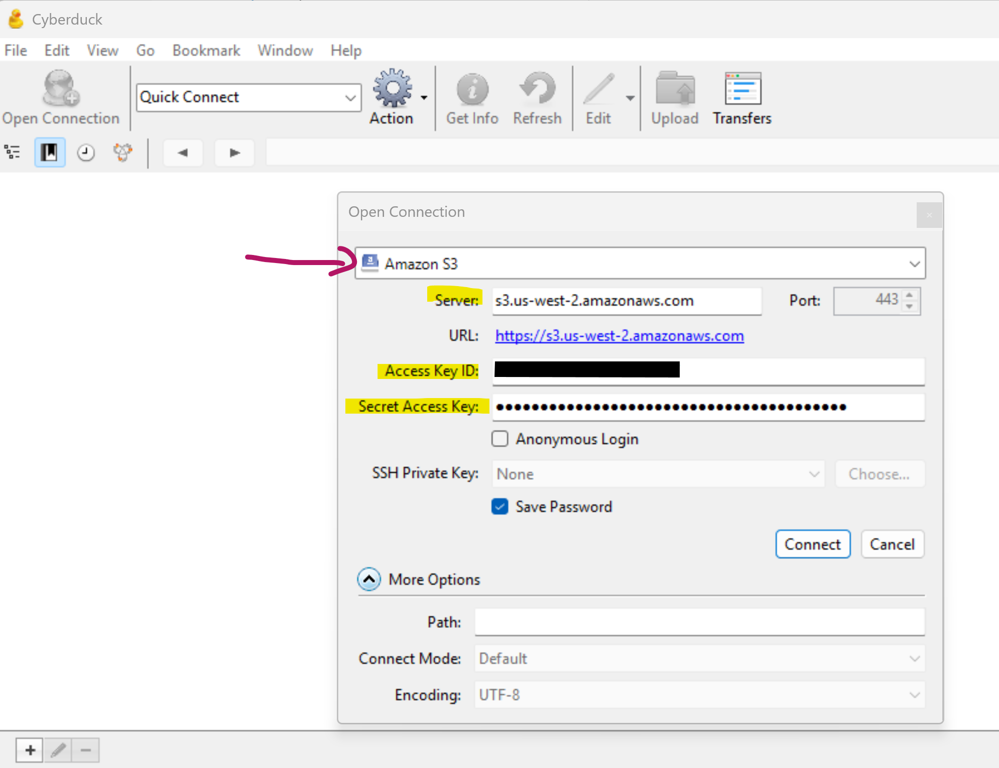
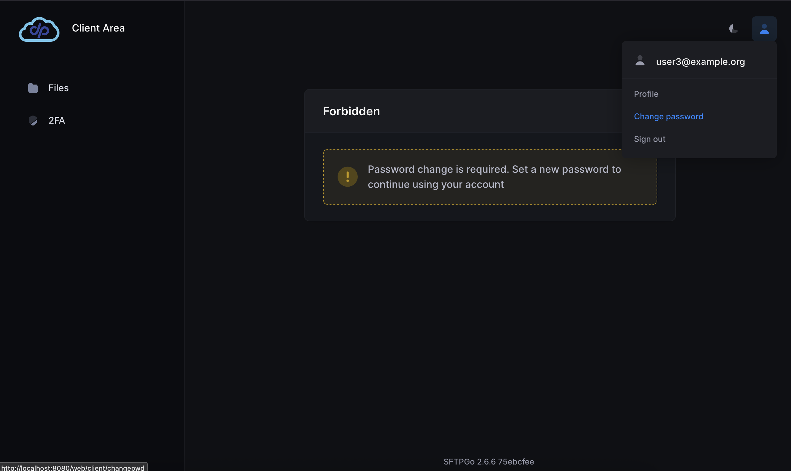
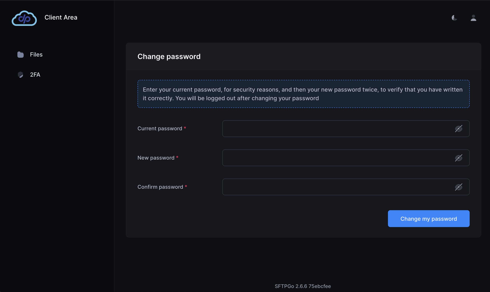
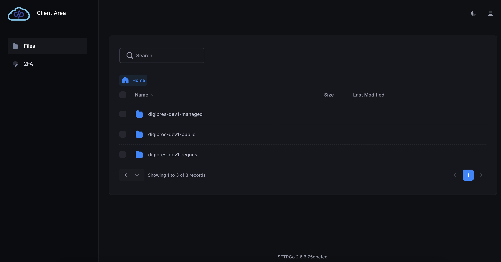

# S3 Client Options

In order to keep things simple for the end user, less complicated to
maintain on the technical side, but also provide some flexibility over
how content can be uploaded to S3, there is no prescribed user
interface. Any S3-compatible client can be used to interact with the tool.

We believe this is the right choice because there are many popular,
well-supported, and tested options already available. However, we
provide streamlined documentation for the use of the open source program
**Cyberduck** as a downloadable GUI option, the **AWS CLI** for command
line usage, and the web-based browser SFTPGo for the simplest access
point.

Here's a list of clients that have been used or tested by Lyrasis staff:

- [AWS CLI](https://aws.amazon.com/cli/)
- [Cyberduck](https://cyberduck.io/)
- [S3Browser](https://s3browser.com/) **(Windows only - we are not providing additional documentation about this option)**
- [SFTPGo](https://sftpgo.com/)

But there are many others and you are free to use any S3 compatible client that you prefer.

After connecting to your S3 account via your preferred method, you will
see the folders already created for your account using your
`dcp-$ID`, including:

- `-managed`
- `-public` (default bucket for files that can be accessed publicly through CloudFront)
- `-request` (used for making create bucket or checksum inventory requests)

## AWS CLI Documentation

### Step 1: Install AWS CLI

[Installing or updating to the latest version of the AWS
CLI](https://docs.aws.amazon.com/cli/latest/userguide/getting-started-install.html)

After following the instructions for your operating system, check your
installation:

``` bash
aws --version
```

### Step 2: Configure Your AWS Credentials

[Configuration and credential file settings in the AWS
CLI](https://docs.aws.amazon.com/cli/latest/userguide/cli-configure-files.html)

Verify your configuration:

``` bash
aws sts get-caller-identity
```

If you have multiple AWS accounts or environments, set up a named
profile and configure with your key, secret, and region (`us-west-2`):

``` bash
aws configure --profile dcp
```

### Setting Region for Lyrasis Hosting

If you are a Lyrasis-hosted client, the AWS region is
**us-west-2**. You can set this in a few ways:

#### 1. Add `--region` directly to the command

This is the most explicit method and overrides all other settings
(profiles, config files, etc.):

``` bash
aws s3 ls --region us-west-2
```

With a profile:

``` bash
aws s3 sync ./data s3://{stackname}-bucket --profile dcp --region us-west-2
```

#### 2. Set the region temporarily in your shell

This applies only to the current terminal session:

``` bash
export AWS_REGION=us-west-2
```

Then commands can be run without specifying the region.

#### 3. Set the region inside the profile

``` ini
[profile dcp]
region = us-west-2
output = json
```

## Cyberduck Documentation

Cyberduck documentation for setting up new connections:\
<https://docs.cyberduck.io/cyberduck/connection/>

### Step-by-step Instructions for DuraCloud Preserve

1. File → Open Connection\
2. Change dropdown menu to **Amazon S3**
    - If you are a Lyrasis Hosting Services client, you may need to update Server to:\
        `s3.us-west-2.amazonaws.com`\
    - (Lyrasis Hosting currently supports `us-west-2` and `us-east-2`)
3. Type in provided Access Key ID and Secret Access Key\
4. Click **Connect**



> [!TIP]
>
> - Click **Go → Enclosing Folder** to navigate up the file path tree
    one level at a time, or click in the filepath dropdown to navigate
    up multiple levels after your connection is set up.
> - Logs and other items you download via Cyberduck will go to your **Downloads** folder by default. You can change this under **Edit → Preferences → Transfers (General tab)**

## SFTPGo Documentation

Navigate to: [DuraCloud Preserve](https://preserve.duracloud.org/web/client/login)

Use this web-based interface to log in, upload, and download content.

Individual users will be provided credentials by their system
administrator (such as the Lyrasis Hosting team). The first time you log
in, you will be asked to change your password. You can do this from the
small person icon in the upper-right corner of the screen.






Note: SFTPGo login sessions are set for 2 hours.

Upon login you will see three folders already created for you:

- `managed`
- `public`
- `request`

From this web-based interface, you may:

- Create new buckets by uploading a request file (see [Creating Buckets](./creating-buckets.md))
- Upload content buckets, creating subfolder structures as needed
- Download content from buckets
- Download reports and other hosted content from the `managed` bucket



> [!Tip]
> Before proceeding, confirm that you are able to successfully connect to S3.
