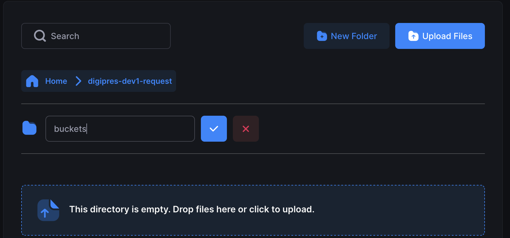
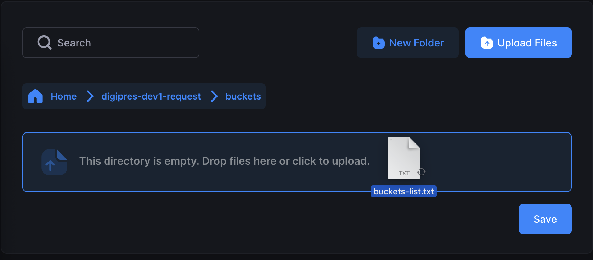

# Creating Buckets

Buckets are folders where you store your content. To create one, you upload a plain text file containing your bucket names to a special request location. The system processes the file automatically and creates your buckets within a few minutes.

> [!IMPORTANT]
> You can create up to **five** buckets per request.

## Step 1: Create your bucket list file

Open a text editor (such as Notepad) and create a plain text (`.txt`) file with one bucket name per line:

```
manuscripts
newspapers
rare-books
```

Save the file with any name, for example `bucket-list.txt`.

### Naming rules

- **Do not include your stack name** — it is added automatically as a prefix
- Use only **letters, numbers, and hyphens** (`-`)
- Names must **not** start or end with a hyphen
- Names must be short enough that the full bucket name stays under 63 characters — the system prepends `dcp-$ID` and reserves `-repl` as a suffix

> [!Tip]
> To make objects publicly accessible, upload directly into the `-public` bucket. Sub-folders can be created within the `-public` bucket to align with your desired asset management methods.

The following are reserved and cannot be used in names: `duracloud-`, `-logs`, `-managed`, `-repl`, `-request`

## Step 2: Upload the file

Upload your `.txt` file to the `buckets` folder inside your `dcp-$ID-request` bucket. If the `buckets` folder does not exist, create it first. The folder **must** be named `buckets` exactly.

### Cyberduck

1. Connect to S3 (see [Connecting to S3](./connecting-to-s3.md)).
2. Navigate to the `dcp-$ID-request` bucket.
3. If a `buckets` folder does not exist, create one: **Action → New Folder**.
4. Open the `buckets` folder and drag your `.txt` file in, or click **Upload**.

> [!Tip]
> If you re-upload the same filename with updated bucket names, Cyberduck may ask you to confirm overwriting. Confirm to proceed. Existing buckets will not be overwritten or deleted by this action.

### SFTPGo

1. Log in to the web interface (see [Connecting to S3](./connecting-to-s3.md)).
2. Navigate to the `request` folder.
3. If a `buckets` sub-folder does not exist, click **New Folder** and name it `buckets` exactly.



4. Open the `buckets` folder, then click **Upload Files** or drag your `.txt` file into the upload area.



5. Click **Save** to complete the upload.

### AWS CLI

```bash
aws s3 cp bucket-list.txt s3://dcp-$ID-request/buckets/bucket-list.txt
```

## What happens next

Processing normally takes **0–2 minutes**. For each name in your file, two buckets are created:

- `duracloud-$ID-<name>` — your active bucket
- `duracloud-$ID-<name>-repl` — a Glacier Deep Archive replication bucket (list-only; **you will not have access to add to or download content from this replicated bucket**)

A results file is uploaded to the `feedback` folder in your `-managed` bucket. Check it to confirm all buckets were created successfully, then refresh your client or reconnect to see them.

To create more buckets, update your file with new names and upload it again.

## Troubleshooting

- **No buckets were created** — check the `feedback` folder in your `-managed` bucket for error messages.
- **One name has an error** — none of the buckets in that request will be created. Fix the name(s) as necessary and upload the file again.

