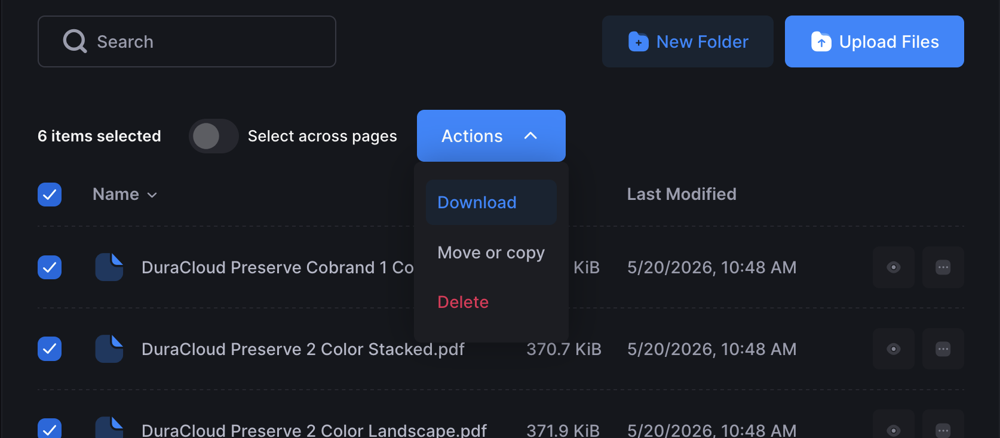

# Downloading Content

You can download content from any bucket you have access to using Cyberduck, SFTPGo, or the AWS CLI.

> [!IMPORTANT]
> You cannot download content from replication buckets (buckets ending in `-repl`). Those are managed by the system for backup purposes. If you need to recover content from a replication bucket due to accidental deletion or corruption, contact your hosting provider.

## AWS CLI

Download a folder:

```bash
aws s3 sync s3://duracloud-$ID-mybucket/myfolder ./local-folder
```

Download a single file:

```bash
aws s3 cp s3://duracloud-$ID-mybucket/myfile.txt .
```

Replace `duracloud-$ID-mybucket` with the name of the bucket you are downloading from.

For full AWS CLI documentation, see https://docs.aws.amazon.com/cli/latest/userguide/cli-services-s3-commands.html

## Cyberduck

1. Connect to S3 (see [Connecting to S3](./connecting-to-s3.md)).
2. Navigate to the bucket and folder you want to download from.
3. Select the file(s) or folder(s) you want to download.
4. Right-click (or Control-click on Mac) and choose a download option:
   - **Download** — saves to your Downloads folder (or your configured default)
   - **Download As** — rename the file as you save it
   - **Download To** — choose a different save location

[!Tip]
If you're attempting to download from a bucket to which you don't have download rights, such as a replication bucket, you will get a "Bad request. Request error" message or similar.

For full Cyberduck documentation, see https://docs.cyberduck.io/cyberduck/download/

## SFTPGo

1. Log in to the web interface (see [Connecting to S3](./connecting-to-s3.md)).
2. Navigate to the folder containing the content you want to download.
3. Check the box next to the file(s) you want to download.
4. Click **Actions** and select **Download**. Selected items will be zipped automatically.

To download a single file without zipping, click directly on its filename.

> [!Tip]
> Some file types (such as `.jpg`, `.txt`, and `.pdf`) can be previewed directly in your browser by clicking the eye icon to the right of the filename.

