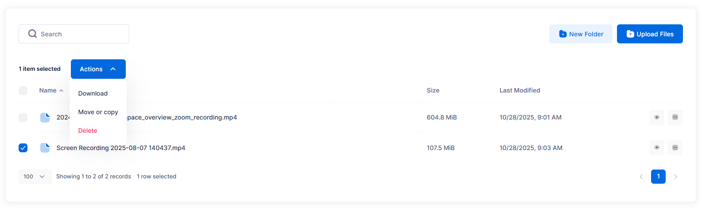

# Downloading Content
Remember that you will not be able to download content from your replicated buckets (buckets ending in `-repl`). If you need to get content from the replicated buckets, in case of accidental deletion or corruption, you will need to ask your hosting provider for assistance.

## AWS CLI Option
Refer to https://docs.aws.amazon.com/cli/latest/userguide/cli-services-s3-commands.html

Download files from bucket

```bash
aws s3 sync s3://{stackname}-bucket/myfolder ./local-folder
```

Download a single file
```bash
aws s3 cp s3://{stackname}-bucket/myfile.txt .
```

## Cyberduck
Refer to https://docs.cyberduck.io/cyberduck/download/
If you right- or control-click on an item or selected group of items to download, you will have the options to:
- Download — goes to your general preferences folder or the system Downloads folder if not changed
- Download As — change the type of an individual item
- Download To — change where the item(s) are saved

## SFTPGo
In order to download content from SFTPGo, navigate to the folder structure you wish to download from and select the folder(s) or item(s) you wish to download. The application will let you download, move, or copy content from a dropdown menu after you've selected content. This option will automatically zip up all selected items. If you just want to download a single item, click directly on its filename. This option will not work if you want to download a folder of content.



> [!Tip]
> You may be able to view some file types directly in SFTPGo, such as .jpg, .txt, and .pdf files, by clicking on the little eye icon to the right of the filename; the application will use your browser settings.
