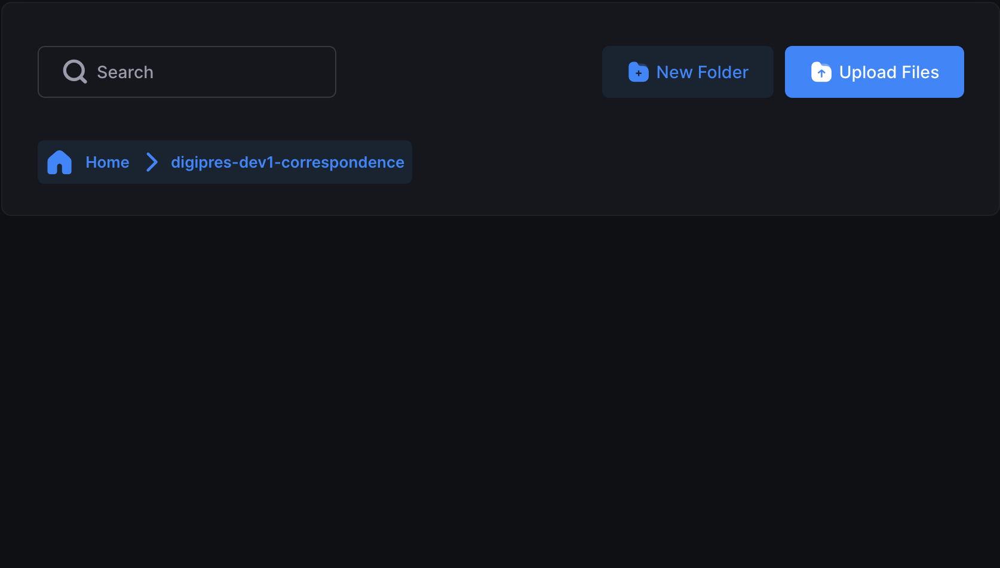

# Uploading Files

You can upload files to any bucket you have access to using Cyberduck, SFTPGo, or the AWS CLI. For information on creating buckets, see [Creating Buckets](./creating-buckets.md).

> [!IMPORTANT]
> After uploading, content is automatically mirrored in the corresponding `-repl` bucket (Glacier Deep Archive). You cannot upload to or manage `-repl` buckets directly — they are managed by the system for backup purposes. You can view filenames in the `-repl` bucket as confirmation that replication occurred, but attempting to download or access files there will result in errors.

> [!Tip]
> This system is designed primarily for the **long-term storage and preservation** of digital assets. Frequent or repeated access to files may lead to increased costs. Use it in accordance with its preservation-focused purpose.

## AWS CLI

Upload an entire folder:

```bash
aws s3 sync ./local-folder s3://duracloud-$ID-mybucket/
```

Upload a single file:

```bash
aws s3 cp myfile.txt s3://duracloud-$ID-mybucket/myfile.txt
```

Replace `duracloud-$ID-mybucket` with the name of the bucket you are uploading to.

For full AWS CLI documentation, see https://docs.aws.amazon.com/cli/latest/userguide/cli-services-s3-commands.html

## Cyberduck

1. Connect to S3 (see [Connecting to S3](./connecting-to-s3.md)).
2. Navigate to the bucket you want to upload to.
3. Drag files or folders from Finder (macOS) or File Explorer (Windows) directly into the Cyberduck window. Alternatively, click the **Upload** button and browse for files.
4. Cyberduck will show a transfer log confirming whether the upload was successful. A pop-up will appear if there are any errors or authorization issues.

For full Cyberduck documentation, see https://docs.cyberduck.io/cyberduck/transfer/

## SFTPGo

1. Log in to the web interface (see [Connecting to S3](./connecting-to-s3.md)).
2. Navigate to the bucket folder you want to upload to.
3. Drag files or folders into the **"drop files here to upload"** area, or click it to browse for files.
4. Review the upload queue to confirm filenames and paths.
5. Click **Save** in the bottom right corner to complete the upload. Your content will not be saved if you skip this step.

> [!NOTE]
> You cannot upload an empty folder in SFTPGo, but you can use the **New Folder** button to create folder structures before uploading content.
>
> 
>
> Uploading very large files (1–2 GB or more) may time out. For large uploads, use Cyberduck or another S3-compatible tool instead.

> [!Tip]
> We have occasionally seen a generic **"Error uploading files"** message in SFTPGo. Closing the error and trying again has resolved it in all known cases. This may be related to an expired session.
EOF