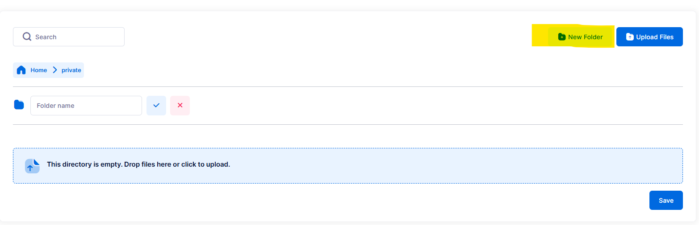
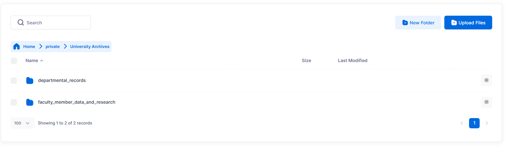

# Uploading Files
You will be able to upload files to the buckets you've created (see [Creating Buckets](./creating-buckets.md)). After your content has been uploaded, it will be mirrored in Glacier Deep Archive in the bucket that duplicates your bucket names with the `-repl` suffix.

You **will not be able to do anything with the content in the `-repl` bucket**. You will be able to see filenames, as a reassurance that your content has been mirrored, but if you attempt to download or get information about the files, you will likely encounter:

- `Access denied`
- `Failure to read attributes of [filename]. Forbidden. Request Error`

or other errors.

Files in these `-repl` buckets will only be accessed in the event of checksum failure in your active file structures, so those files can be replaced by this Glacier Deep Archive copy.

> [!Tip] 
> This tool is intended primarily for the **long-term storage and preservation** of digital assets. Frequent or repeated access to **private files** within the system may lead to **increased operational costs** and could potentially **compromise data integrity**. Users are advised to limit such access and use this tool in accordance with its preservation-focused purpose.

## CLI option
Refer to the AWS CLI S3 documentation:  
https://docs.aws.amazon.com/cli/latest/userguide/cli-services-s3-commands.html

**Upload files (entire folder):**

```bash
aws s3 sync ./local-folder s3://{stackname}-bucket
```

**Upload a single file:**

```bash
aws s3 cp myfile.txt s3://{stackname}-bucket
```

## Cyberduck option
[Cyberduck documentation on File Transfers](https://docs.cyberduck.io/cyberduck/transfer/)

- Uploading folders or individual files is as simple as clicking and dragging from a folder in File Explorer / Finder into the Cyberduck client. Alternatively, click the **Upload** button in the Cyberduck client to browse for files or folders.
- Cyberduck will provide a pop-up log indicating whether the upload was successful. Another pop-up will appear if there are any errors or issues (for example, if you are not authorized to upload to the bucket).

## SFTPGo option
- Uploading folders or individual files is as simple as clicking and dragging from a folder in File Explorer / Finder into the web application. Alternatively, click the **“drop files here to upload”** area to browse for files or folders.
- You cannot upload an empty folder, but you can create folder structures within your `-private` and `-public` folders before uploading content.
- Uploading very large files may take a long time and can time out. If you have files larger than 1–2 GB, you may need to use Cyberduck or another S3-compatible tool.



Use the **New Folder** button to create your folder structure(s) before uploading content.

- The web application will show a list of all files queued for upload so you can confirm filenames and paths.
- After uploading content, **do not forget to click the Save button in the bottom right corner**, or your content will not be uploaded.
- After completion, you will see your preserved file structure. The default display shows 10 results at a time, but this can be increased up to 500.



Screen display showing preserved folder structure and the option to change the number of displayed results.

**Reminder:** You will not see the replicated file structure in the SFTPGo web application, but your files are still being replicated in Glacier.

> [!Tip]
> We have occasionally seen a generic **“Error uploading files”** message in SFTPGo. Closing the error and attempting the upload again has so far worked successfully (sometimes requiring closing the error twice).  
> The cause is not yet certain; it may be related to attempting uploads after a session has expired. This is an area for further investigation and feedback.
